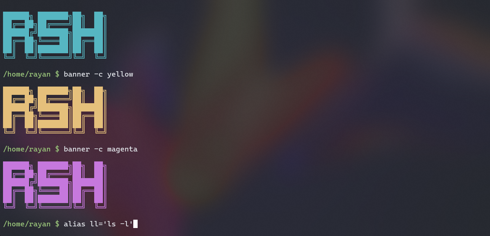

# rsh-shell

A shell written in C for Linux and Unix systems. Covers process forking, pipe creation, signal handling, and terminal I/O.



## Features

- Command execution via `fork` + `execvp`
- Pipelines (`ls | grep foo | wc -l`)
- Builtins: `cd`, `exit [n]`, `alias`, `unalias`, `source`, `help`, `banner`
- `help [-du] [pattern]` — list builtins with descriptions and usage
- Aliases with multi-token expansion (`alias ll="ls -l"`)
- Quoted arguments (`cd "My Folder"`)
- Environment variable expansion (`$HOME`, `$?`, `$$`)
- Startup config file (`~/.rshrc`)
- Command history with persistence (`~/.rsh_history`)
- History expansion (`!!`, `!n`)
- Tab completion

## Requirements

- GCC
- GNU Readline (`sudo apt install libreadline-dev` on Debian/Ubuntu)

## Build

```bash
make
```

Debug build (enables `-Wall -Wextra` warnings and `-g` debug symbols):

```bash
make DEBUG=1
```

```bash
make run       # build and run
make clean     # remove build artifacts
```

## Install

Add `rsh` to your PATH via a symlink to `/usr/bin`:

```bash
make install
```

To remove it:

```bash
make uninstall
```

## Usage

Run directly:

```bash
./build/rsh
```

Or after installing:

```bash
rsh
```

Run as root:

```bash
sudo rsh
```
